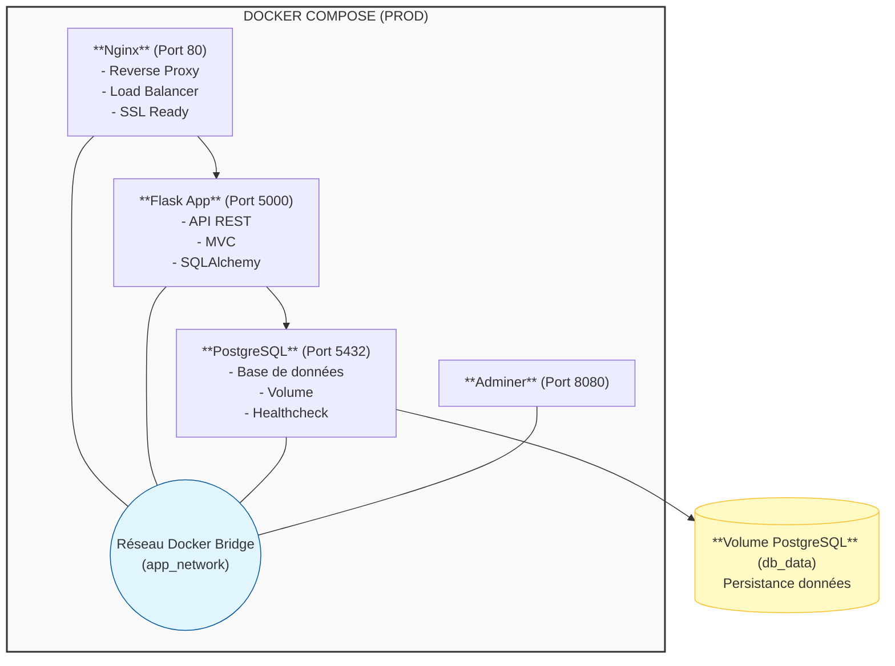
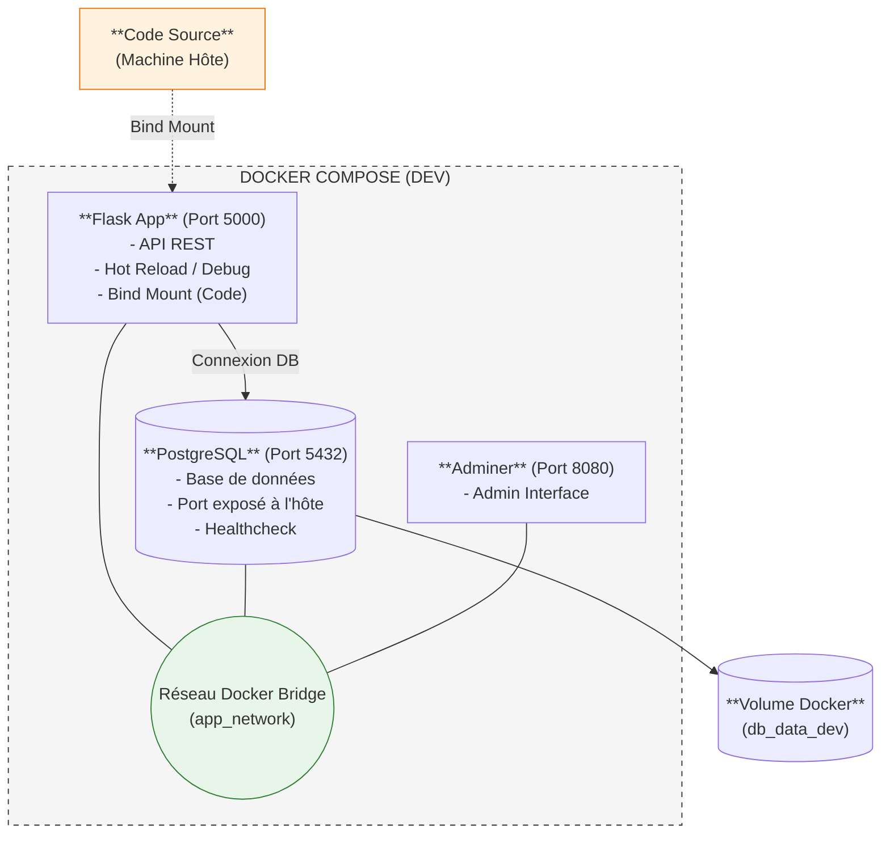
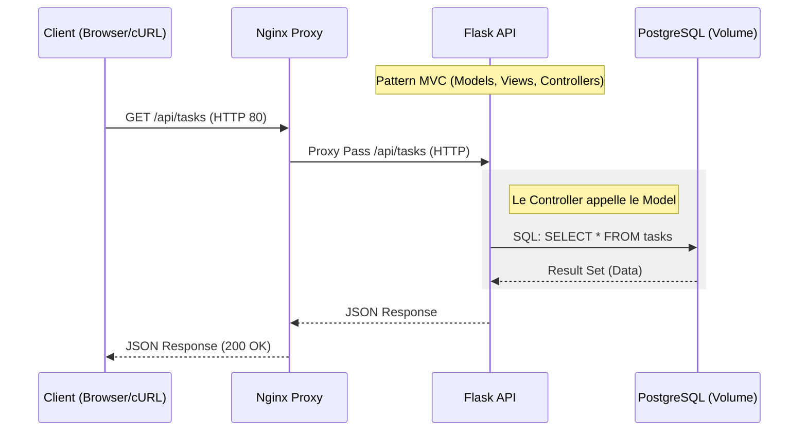
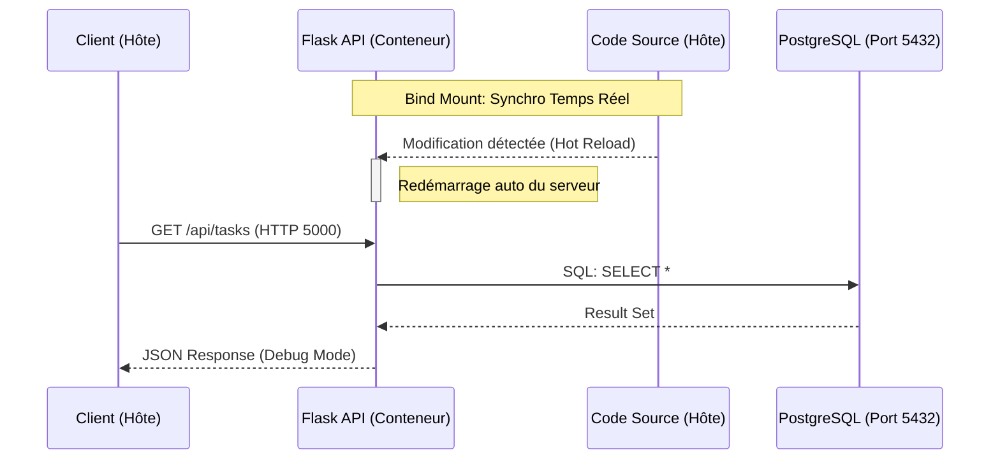
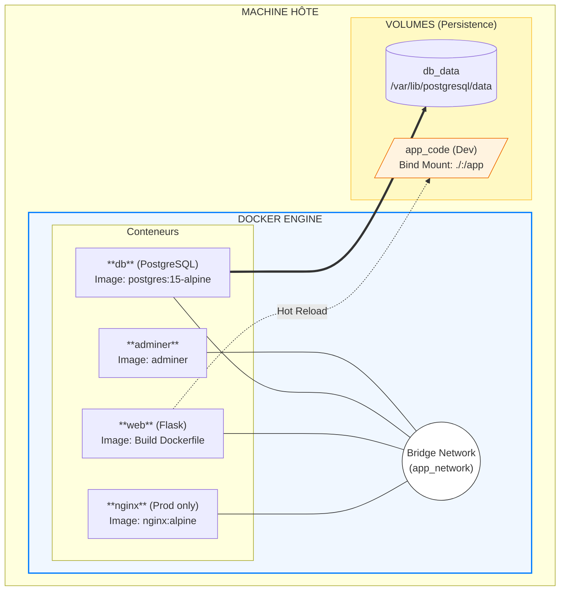

# Documentation de Dockerisation - Todo List API

> **Application Todo List Flask + PostgreSQL conteneurisée**  
---

## Table des matières

- [Vue d'ensemble](#vue-densemble)
- [Prérequis](#prérequis)
- [Architecture](#architecture)
- [Démarrage rapide](#démarrage-rapide)
- [Structure du projet](#structure-du-projet)
- [Commandes disponibles](#commandes-disponibles)
- [Configuration](#configuration)
- [Modes de déploiement](#modes-de-déploiement)
- [Bonnes pratiques](#bonnes-pratiques)

---

## Vue d'ensemble

Ce projet est une application Todo List développée avec Flask (Python) et PostgreSQL, entièrement dockerisée pour permettre un déploiement reproductible sur n'importe quelle machine équipée de Docker.

### Fonctionnalités principales

- [X] API REST complète (CRUD) pour la gestion des tâches
- [X] Base de données PostgreSQL avec persistance des données
- [X] Nginx comme reverse proxy (mode production)
- [X] Interface Adminer pour l'administration de la base de données
- [X] Healthcheck automatique de PostgreSQL
- [X] Deux modes : développement et production
- [X] Scripts automatisés (Makefile)

---

## Prérequis

### Logiciels requis

| Logiciel | Version minimale | Installation |
|----------|------------------|--------------|
| **Docker** | 20.10+ | [Docker Install](https://docs.docker.com/get-docker/) |
| **Docker Compose** | 2.0+ | Inclus avec Docker Desktop |

### Vérification de l'installation

```bash
# Vérifier Docker
docker --version
# Attendu : Docker version 20.10.x ou supérieure

# Vérifier Docker Compose
docker compose version
# Attendu : Docker Compose version v2.x.x ou supérieure

```

### Ports nécessaires

Assurez-vous que les ports suivants sont **libres** sur votre machine :

#### Mode Développement

| Port | Service | Description |
|------|---------|-------------|
| `5000` | Flask API | Application web principale (accès direct) |
| `5432` | PostgreSQL | Base de données (exposé pour debug) |
| `8080` | Adminer | Interface d'administration PostgreSQL |

#### Mode Production

| Port | Service | Description |
|------|---------|-------------|
| `80` | Nginx | Reverse proxy (point d'entrée unique) |
| `8080` | Adminer | Interface d'administration PostgreSQL |

> **Note** : En production, Flask n'est PAS exposé directement. Nginx gère toutes les requêtes HTTP.

**Vérifier qu'un port est libre :**

```bash
# Linux/Mac
lsof -i :5000
lsof -i :5432
lsof -i :80

# Windows (PowerShell)
Get-NetTCPConnection -LocalPort 5000
Get-NetTCPConnection -LocalPort 5432
Get-NetTCPConnection -LocalPort 80
```

---

## Architecture

### Schéma des services - Mode Production



### Schéma des services - Mode Développement



### Flux de données - Production



### Flux de données - Développement



### Diagramme de déploiement



---

## Démarrage rapide

### Installation en 3 étapes

#### 1. Cloner le projet

```bash
git clone https://github.com/HamzaNADIFI07/Todo_List
cd Todo_List
```

#### 2. Configurer les variables d'environnement

```bash
# Copier le fichier d'exemple
cp .env.example .env

# Éditer le fichier .env
nano .env
```

#### 3. Lancer l'application

```bash
# Mode développement (avec bind mount du code)
docker compose -f docker-compose.dev.yml up -d

# OU mode production (avec Nginx)
docker compose -f docker-compose.prod.yml up -d

# OU avec le Makefile
make dev   # Développement
make prod  # Production
```

### Vérification du déploiement

```bash
# Vérifier que les conteneurs sont en cours d'exécution
docker compose -f docker-compose.dev.yml ps
```

### Premier test

#### Mode développement

```bash
# Tester l'API de santé
curl http://localhost:5000/health

# Attendu : {"status": "ok"}

# Lister les tâches
curl http://localhost:5000/api/tasks

# Attendu : []  (liste vide au démarrage)
```

#### Mode production

```bash
# Tester via Nginx (port 80)
curl http://localhost/health

# Attendu : {"status": "ok"}

# Lister les tâches
curl http://localhost/api/tasks

# Attendu : []
```


---

## Structure du projet

```
Todo_List/
  ├── assets/
  ├── controllers              # Contrôleurs MVC
  │   └── todo_controller.py
  ├── database.py
  ├── docker-compose.dev.yml   # Compose pour développement
  ├── docker-compose.prod.yml  # Compose pour production
  ├── Dockerfile               # Image de l'application Flask
  ├── .env.example             # Template des variables d'environnement
  ├── .env                     # Variables d'environnement (à créer, non versionné)
  ├── .dockerignore            # Fichiers exclus du build
  ├── main.py                  # Point d'entrée Flask
  ├── Makefile                 # Raccourcis de commandes
  ├── models                   # Modèles de données
  │   └── task.py
  ├── nginx                    # Configuration Nginx (mode production)
  │   └── default.conf
  ├── README_DOCKERISATION.md  # Documentation Docker
  ├── README.md                # Documentation générale
  ├── requirements.txt         # Dépendances Python
  ├── reset.sh                 # Script de reset complet
  └── views                    # Vues et templates
      └── cli.py
```

---

## Commandes disponibles

### Avec Docker Compose

#### Mode développement

```bash
# Démarrer les services
docker compose -f docker-compose.dev.yml up -d

# Voir les logs en temps réel
docker compose -f docker-compose.dev.yml logs -f

# Voir les logs d'un service spécifique
docker compose -f docker-compose.dev.yml logs -f web
docker compose -f docker-compose.dev.yml logs -f db

# Arrêter les services
docker compose -f docker-compose.dev.yml down

# Arrêter et supprimer les volumes
docker compose -f docker-compose.dev.yml down -v

# Redémarrer un service
docker compose -f docker-compose.dev.yml restart web
```

#### Mode production

```bash
# Démarrer les services
docker compose -f docker-compose.prod.yml up -d

# Build et démarrage
docker compose -f docker-compose.prod.yml up -d --build

# Voir les logs
docker compose -f docker-compose.prod.yml logs -f

# Arrêter les services
docker compose -f docker-compose.prod.yml down

# Rebuild sans cache
docker compose -f docker-compose.prod.yml build --no-cache
```

### Avec Makefile

```bash
# Développement
make dev          # Démarrer en mode dev
make down       # Arrêter le mode dev
make logs       # Voir les logs

# Production
make prod         # Démarrer en mode prod
make down      # Arrêter le mode prod

# Utilitaires
make reset           # Reset complet (stop + suppression volumes)
make clean           # Nettoyage complet
```

### Commandes PostgreSQL utiles

```bash
# Se connecter à PostgreSQL depuis le conteneur
docker compose -f docker-compose.dev.yml exec db psql -U user -d nom_de_la_base

# Lister les tables
\dt

# Voir le schéma d'une table
\d tasks

# Exécuter une requête SQL
SELECT * FROM tasks;

# Quitter psql
\q

# Backup de la base de données
docker compose -f docker-compose.dev.yml exec db pg_dump -U user nom_de_la_base > backup.sql

# Restaurer un backup
docker compose -f docker-compose.dev.yml exec -T db psql -U user nom_de_la_base < backup.sql
```

---

## Configuration

### Healthchecks

Les healthchecks sont configurés pour garantir que les services sont prêts avant de démarrer les services dépendants.

#### PostgreSQL Healthcheck

```yaml
healthcheck:
  test: ["CMD-SHELL", "pg_isready -U ${POSTGRES_USER} -d ${POSTGRES_DB}"]
  interval: 5s      # Vérifie toutes les 5 secondes
  timeout: 5s       # Timeout de 5 secondes
  retries: 5        # 5 tentatives avant de marquer comme unhealthy
```

**Vérifier le healthcheck :**

```bash
docker inspect todo-list-db-1 | grep -A 20 Health
```

### Dépendances entre services

```yaml
services:
  web:
    depends_on:
      db:
        condition: service_healthy  # Attend que PostgreSQL soit "healthy"
```

Cela garantit que Flask ne démarre pas avant que PostgreSQL soit prêt à accepter des connexions.

---

## Modes de déploiement

### Mode Développement (`docker-compose.dev.yml`)

**Caractéristiques :**
- [X] Bind mount du code source (modifications en temps réel)
- [X] Adminer inclus pour l'administration
- [X] Flask en mode debug (`FLASK_DEBUG=1`)
- [X] Port PostgreSQL exposé (5432) pour accès direct
- [X] Port Flask exposé (5000) pour accès direct
- [X] Hot-reload activé (pas besoin de rebuild)
- [ ] Pas de Nginx (accès direct à Flask)

**Utilisation :**
```bash
docker compose -f docker-compose.dev.yml up -d
```

**Avantages :**
- Modification du code sans rebuild
- Accès direct à la base de données
- Interface graphique Adminer pour PostgreSQL
- Logs détaillés pour le debug
- Temps de développement réduit

### Mode Production (`docker-compose.prod.yml`)

**Caractéristiques :**
- [X] Nginx comme reverse proxy
- [X] Image optimisée et buildée
- [X] Pas de bind mount (code compilé dans l'image)
- [X] PostgreSQL isolé (pas de port exposé)
- [X] Flask non exposé directement (via Nginx uniquement)
- [X] Restart policy : `always`
- [x] Configuration optimisée pour la production

**Utilisation :**
```bash
docker compose -f docker-compose.prod.yml up -d --build
```

**Avantages :**
- Performance optimale
- Sécurité renforcée (isolation réseau)
- Load balancing via Nginx
- Gestion des fichiers statiques par Nginx
- Prêt pour SSL/TLS
- Image portable

### Comparaison des modes

| Aspect | Développement | Production |
|--------|---------------|------------|
| **Bind mount** |  Oui (`./:/app`) |  Non |
| **Hot-reload** |  Oui |  Non |
| **Adminer** |  Oui (8080) |  Oui (8080) |
| **Nginx** |  Non |  Oui (port 80) |
| **Flask exposé** |  Oui (5000) |  Non (interne) |
| **PostgreSQL exposé** |  Oui (5432) |  Non (interne) |
| **Debug mode** |  Oui |  Non |
| **Restart policy** | Par défaut | `always` |
| **Image size** | Plus grande | Optimisée |
| **Sécurité** | Faible | Élevée |
| **Performance** | Normale | Optimale |
| **SSL/TLS** |  Non |  Ready |

---

## Bonnes pratiques

### Sécurité

1. **Ne jamais commiter le fichier `.env`**

```bash
# Vérifier .gitignore
cat .gitignore | grep .env

# Devrait contenir :
.env
```

2. **Utiliser des mots de passe forts en production**

```env
# MAUVAIS
POSTGRES_PASSWORD=password

# BON
POSTGRES_PASSWORD=xK9$mP2@vL5#nR8!qW4
```

Générer un mot de passe fort :
```bash
openssl rand -base64 32
```

3. **Limiter l'exposition des ports en production**

```yaml
# MAUVAIS (mode prod)
services:
  db:
    ports:
      - "5432:5432"  # PostgreSQL accessible depuis l'extérieur

# BON (mode prod)
services:
  db:
    # Pas de ports exposés, uniquement accessible via le réseau Docker
```

### Performance

1. **Utiliser le mode production pour le déploiement**

```bash
# BON en production
docker compose -f docker-compose.prod.yml up -d
```

2. **Utiliser des images Alpine (plus légères)**

```yaml
# Déjà utilisé dans le projet
db:
  image: postgres:15-alpine  # ~80 MB vs ~300 MB pour postgres:15
```

### Maintenance

1. **Sauvegarder régulièrement la base de données**

```bash
# Export manuel
docker compose -f docker-compose.dev.yml exec db pg_dump -U user nom_de_la_base > backup_$(date +%Y%m%d_%H%M%S).sql

# Script de backup automatique
#!/bin/bash
BACKUP_DIR="./backups"
mkdir -p $BACKUP_DIR
docker compose -f docker-compose.prod.yml exec -T db pg_dump -U user nom_de_la_base | gzip > $BACKUP_DIR/backup_$(date +%Y%m%d_%H%M%S).sql.gz
```

2. **Restaurer un backup**

```bash
# Décompresser et restaurer
gunzip < backup_20260129_153000.sql.gz | docker compose -f docker-compose.dev.yml exec -T db psql -U user nom_de_la_base
```

3. **Nettoyer les images et volumes non utilisés**

```bash
# Nettoyer les images
docker image prune -a

# Nettoyer les volumes
docker volume prune

# Nettoyer tout (dangereux pour les données)
docker system prune -a --volumes
```
